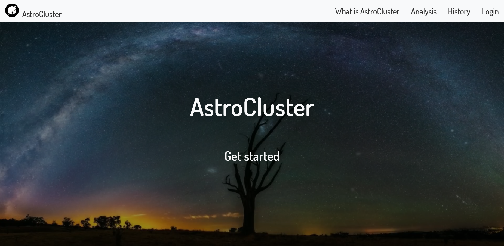

# AstroCluster
AstroCluster is a framework agnostic clustering tool specializing in semantic clustering of projects and technical debt, with a vision of supporting various languages and clustering paradigms.
<br/>


## Prerequisites
- Docker Compose (version ≥ 3.8)
- Python (for evaluating and fine-tuning models only, ignore for build process)

## Installation and Deployment

- In order to full build and deploy the project as it is, run the following script from the **root** of the project:

```bash
./build.sh
```

This will build and deploy all services with the default configuration (skips no service). To customize the build process, the user can enter any combination of the following flags:
- ```--skip-ui```: Skips the build process of the client UI.
- ```--skip-server```: Skips the build process of the backend server.
- ```--skip-grpc```: Skips the automatic gRPC generation from proto files.
- ```--skip-ac```: Skips the build process of the AstroCluster clustering service.
- ```--skip-db```: Skips the build process of the database.

## Contributing
Feel free to contribute to the project (either creating new models, improving existing models or bugs) by opening issues <a href="https://github.com/setokk/AstroCluster/issues">here</a>.

## License
The project follows the Eclipse Public License v2.0 (EPL-2.0 license).

## Info
This tool was developed in the context of my Bachelor Thesis "AstroCluster: A Framework Agnostic Clustering Tool for Semantic Analysis of Projects and Technical Debt" under the supervision of Professor A. Ampatzoglou and N. Nikolaidis.


